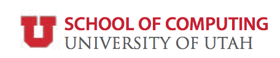

# 2017 Data Science Day

* **Date**: Friday. Jan 13, 2017

* **Location**: Union (Main ballroom and Saltair room)

**Sponsored by**

## Agenda

| 11:30 AM - 1:00 PM | [Data Science Job Fair](#recruiters)                                  |
| 1:00 PM - 1:10 PM  | Welcome: Data Science at Utah                                         |
| 1:10 PM - 2:00 PM  | [Panel: Data Science in Industry](#panel-on-data-science-in-industry) |
| 2:00 PM - 3:30 PM  | [Posters and Demos](#posters-and-demos)                               |
| 3:30 PM - 4:50 PM  | [Data Science + X Talks](#data-science--x-talks)                      |
| 5:00 PM - 6:00 PM  | [Keynote](#keynote)                                                   |
| 6:00 PM - 6:15 PM  | Poster Awards !!                                                      |

----

### Posters and Demos

We welcome all students, staff, and faculty at the University of Utah
to sign up below to present a poster or demo at the Utah Data Science
Day 2017.

<a class="btn btn-default" href="http://www.cs.utah.edu/bigdata/poster" role="button">Sign up as a presenter</a>

**Sign-up Deadline**: Tuesday. Jan 10, 2017

### Recruiters

We welcome all companies both local and beyond to station a booth, at
no cost, at the Utah Data Science Day 2017.

<a class="btn btn-default" href="http://www.cs.utah.edu/bigdata/recruiting" role="button">Sign up for a recruiting booth</a>

----

### Confirmed Participation

Currently, we have confirmed participation from the following
companies:

* OC Tanner
* Overstock.com
* InsideSales.com
* Domo
* Goldman Sachs
* IM Flash
* HireVue
* Recursion Pharmaceuticals
* Ziff
* BioFire Diagnostics
* Ancestry.com
* Amazon.com

### Keynote 

*Speaker*: [Edo Liberty](https://edoliberty.github.io//) 

*Bio*: Edo Liberty is a Principal Scientist at Amazon AWS Machine
Learning group.  Prior to joining Amazon this year, he was head of
Yahoo's Independent Research in New York where he focused on scalable
machine learning and data mining for Yahoo critical applications.  He
received his B.Sc in Physics and Computer Science from Tel Aviv
university and his Ph.D in Computer Science from Yale University.
After that, he was a Post-Doctoral fellow at Yale in Program in
Applied Mathematics.  His personal research interests include fast
dimensionality reduction, clustering, streaming and online algorithms,
machine learning, and large scale numerical linear algebra. His
research has garnered best papers at KDD 2013, TechPulse 2012, and
SODA 2011.

*Talk Title*: Distributed Streaming Algorithms in Realtime Data Mining

*Abstract*: This talk will introduce the distributed streaming
computational model. In this model, different parts of the data are
streamed to different machines that cannot communicate with each
other. Moreover, each machine examines the data stream once and
operates with severe memory limitations. This is de facto the standard
setting in large-scale IoT applications, information security
tracking, and dynamic monitoring, just to name a few. Even though this
computational model is challenging, some remarkable algorithmic
results enable a wide set of capabilities.

In this talk, I will explain the distributed streaming setting and its
limitations. Then, I will show how to approximate frequencies of items
in streams and how this can be used for threading Mail by large e-mail
providers. After that, I will show a very new result (FOCS 2016) which
solves optimally the streaming quantiles problem. I will conclude with
a short demo of an open source library for streaming algorithms that I
contribute to.

Amazon's AI group is looking for full-time scientists, engineers, and
interns. Don't be shy about leaving a copy of your resume with me at
the end of the talk or sending it to me by email
(<a href="mailto:libertye@amazon.com">libertye@amazon.com</a>).

----

### Data Science + X Talks

* [Tom Greene](http://medicine.utah.edu/faculty/mddetail.php?facultyID=u0553599):
  Data Science + Health Sciences

* [John Horel](http://home.chpc.utah.edu/~u0035056/home/):
  Data Science + Atmospheric Sciences

* [Olivia Sheng](https://faculty.utah.edu/u0358028-Olivia_Sheng/bibliography/index.hml):
  Data Science + Business Analytics

* [Zac Imel](https://faculty.utah.edu/u0377435-ZAC_E_IMEL/biography/index.hml):
  Data Science + Mental Health

----

### Panel on Data Science in Industry

* **Dylan Zwick**: 
  Director of Data Science at Overstock.com.
  
* **Hehe (Kate) Feng**: 
  Research Engineer at InsideSales.com.
  
* **Niel Nickolaisen**: 
  Chief Technology Officer at O.C. Tanner.

* **Jeremy Morris**: 
  Senior Data Scientist at Domo.

* **Mark Sharrock**:
  Tech Fellow and Vice President, Goldman Sachs, Technology Division.

----

[2017 Data Science Day poster](./img/Poster-dataday.pdf)