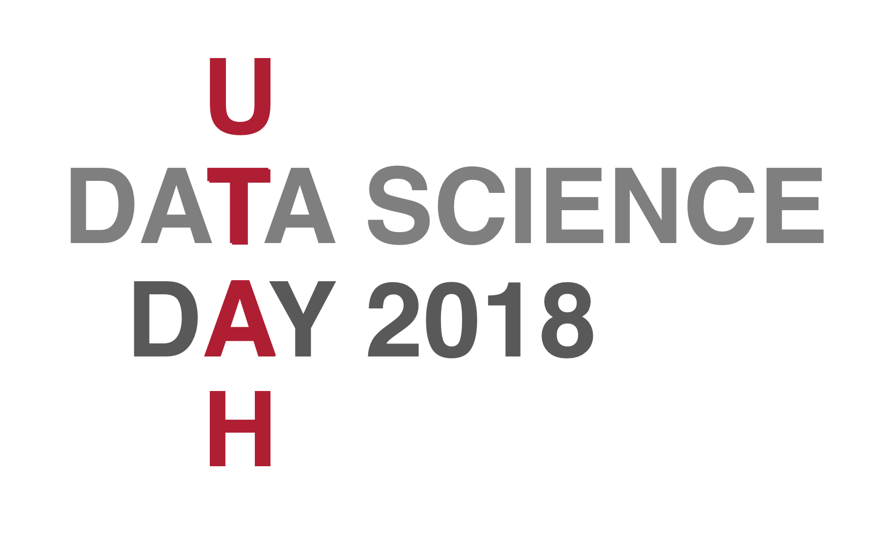

{: width=150 height=100}

# 2018 Data Science Day

* **Date**: Friday. Sep 14, 2018

* **Location**: Union ballroom

**Sponsored By**

## Agenda

| 9:00 AM - 1:00 PM |   | [PIPELINE Career Expo](#pipeline-career-expo)                          |
| 1:00 PM - 2:00 PM |   | [Posters and Demos](#posters-and-demos)                                |
| 2:00 PM - 2:30 PM |   | Welcome address: Dan Reed,  Senior Vice President for Academic Affairs |
| 2:30 PM - 3:30 PM |   | [Panel: Data Science in Industry](#panel-on-data-science-in-industry)  |
| 3:30 PM - 4:50 PM |   | [Data Science + X Talks](#data-science--x-talks)                       |
| 5:00 PM - 6:00 PM |   | [Keynote Talk](#keynote-talk)                                          |
| 6:00 PM - 6:15 PM |   | Poster Awards !!                                                       |

----

### PIPELINE Career Expo

Currently, we have confirmed participation from the following
organizations:

* BioFire Diagnostics
* Bookly Inc
* Galileo Processing
* Goldman Sachs
* Hill Air Force Base
* HireVue
* Instructure
* L3
* National Security Agency
* OODA Health
* Proofpoint
* Recursion Pharmaceuticals
* Sandia National Laboratories
* Skullcandy
* State of Utah
* The Church of Jesus Christ of Latter Day Saints
* Xima Software

----

### Posters and Demos

We welcome all students, staff, and faculty at the University of Utah
to sign up below to present a poster or demo at the Utah Data Science
Day 2018.

<a class="btn btn-default" href="http://www.cs.utah.edu/bigdata/poster" role="button">Sign up as a presenter</a>

**Sign-up Deadline**: Monday. Sep 10, 2018

----

### Keynote Talk

**Speaker**: [Usama M. Fayyad](https://fayyad.com/), PhD. Co-Founder & CTO, OODA Health (Twitter @usamaf)

**Talk Title**: *Navigating the rapidly changing data landscape with AI/ML: the pragmatic economic opportunity of big data*

**Abstract**: Unstructured data and big data platforms have forced a disruptive change that has left most enterprises in data chaos. The combination of new economic drivers in enterprise computing, the need to leverage semi-structured and unstructured data, and the emergence of the Internet of Things (IOT), is driving a dramatic shift in the enterprise data landscape. Hadoop and the open source stack have accelerated the changes to a point of confusion. This has led business data analysts to face a bewildering environment of technologies and challenges involving semi-structured and unstructured data with access methodologies that have almost no relation to the past. IT and business users face equal confusion. Yet, the ability to drive significant business value from “data assets” has never been greater. 
 
In this talk, Dr. Fayyad will cover:
1.	A historical summary of AI and machine learning, including what has worked, what didn’t, and why
2.	Why big data is different
3.	Economic drivers for change in storage technology
4.	Why the requirement for real-time data streaming and analysis is stronger than ever
5.	Why data science and related fields have become critical to almost all future analytical tasks
6.	How every company is becoming a big data company, even the smallest organizations
7.	How to fit the benefits of advanced analytics within the modern healthcare technology stack, and their accompanying issues and challenges
8.	Case studies showing the challenges and opportunities for big data, data science, and AI/ML

**Speaker Bio**

Usama Fayyad is co-founder and chief technology officer (CTO) at OODA Health. OODA Health was founded in 2017 and is focused on removing waste and inefficiency from the healthcare administrative system by using an innovative approach to change the paradigm between payers, patients and providers. As leader of the technology team, Usama is responsible for designing and building the OODA platform to leverage AI/ML in service of delivering a retail payment experience for providers and members.
 
Usama is also chairman at Open Insights, a technology and strategic consulting firm he founded in 2008, that helps enterprises deploy data-driven solutions to grow revenue from data assets. Previous to OODA Health, Usama served as global chief data officer and group managing director at Barclays in London, after he launched the largest tech startup accelerator in MENA as Executive Chairman of Oasis500 in Jordan.
 
His background includes chairman and CEO roles at several startups, including Blue Kangaroo Corp, DMX Group, and digiMine Inc (Audience Science). Usama was the first person to hold the chief data officer title when Yahoo! acquired his second startup in 2004. At Yahoo! he built the Strategic Data Solutions group and founded Yahoo! Research Labs, where early work on big data led to open source and the launch of Hadoop. He has held leadership roles at Microsoft and founded the Machine Learning Systems group at NASA's Jet Propulsion Laboratory, where his work on machine learning resulted in the top Excellence in Research award from Caltech, and a US Government medal from NASA. 
 
Usama has published over 100 technical articles on data mining, data science, AI/ML, and databases. He holds over 30 patents and is a fellow of both the Association for the Advancement of Artificial Intelligence (AAAI) and the Association for Computer Machinery (ACM).  Usama earned his PhD in Engineering in AI and Machine Learning from the University of Michigan Ann Arbor. He has edited two books on data mining and served as editor-in-chief of two key industry journals. He also served on the boards or advisory boards of several private and public companies including: Criteo, Invensense, RapidMiner, Stella.AI, Virsec, Silniva, Abe.AI, NetSeer, Choicestream and Medio. On the academic front he is on advisory boards of the Data Science Institute at Imperial College, AAI at UTS, and The University of Michigan College of Engineering National advisory board

----
### Data Science + X Talks

* [Harish Bhat](http://www.math.utah.edu/~hbhat/):
  Data Science + Sports

* [Alex Lex](http://vdl.sci.utah.edu/team/lex/):
  Data Science + Visualization

* [Amanda Smith](https://energysystems.mech.utah.edu/):
  Data Science + Energy

* [Taylor Sparks](https://pubweb.eng.utah.edu/~sparks/):
  Data Science + Materials

----

### Panel on Data Science in Industry

* **McKay Hyde**, Goldman Sachs
* **Melanie Crandall**, L3
* **Berton Earnshaw**, Recursion Pharma
* **Joshua Coon**, Sandia National Laboratory

----

[2018 Data Science Day poster](./img/Poster-dataday.pdf)

##### Previously: [Data Science Day 2017](../2017)

