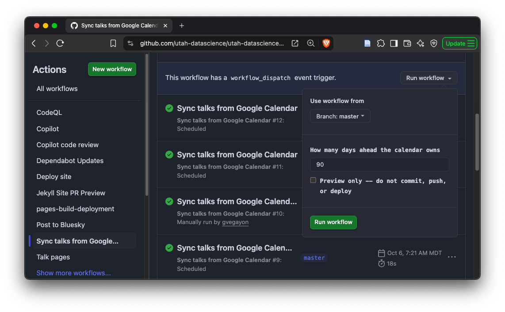

# Calendar sync

How a talk on the seminar's Google Calendar ends up on the website, and how to
nudge that process by hand.

## How it works

```
Google Calendar  --(public .ics feed, read-only)-->  sync-talks.yml  (GitHub Action, hourly)
                                                       |
                  scripts/import_calendar_talks.py --sync   parse events, update _data/talks/*.toml
                  scripts/tag_talks.py                      fill in tags for new records
                  scripts/generate_talks.py                 regenerate _talks/*.md, talks.ics, talks.json
                                                       |
                                          commit straight to master (only if something changed)
                                                       |
                                          pages.yml  -->  site republished
```

* **Google Calendar is the source of truth** for any talk starting within the
  [sync window](#the-sync-window) (90 days by default). Edit the calendar event;
  do not edit the repository's TOML record for it.
* The workflow `.github/workflows/sync-talks.yml` runs **every hour, every day**
  (at minute 7 -- GitHub delays and sometimes drops scheduled runs at the top of
  the hour). It reads the calendar's *public* iCal feed, so it needs no
  credentials and **never writes back to Google Calendar**.
* If the calendar and the repository already agree, the run ends without a
  commit, so a quiet week leaves no trace in the git history. When something
  did change, the workflow commits to master and starts the deploy itself
  (a push made with the built-in `GITHUB_TOKEN` does not trigger other
  workflows, so it calls `pages.yml` explicitly).
* In practice, **the website can be up to about an hour behind the calendar**
  (a bit more if GitHub is slow to start the scheduled run, plus a couple of
  minutes to build and publish). The seminar page says so, with a link to the
  calendar, which is always current.

## Why hourly checks and not a webhook

We looked at pushing changes from Google Calendar instead of polling, and chose
to keep polling. Google Calendar's push notifications (`events.watch`) need a
public HTTPS server we would have to run, authenticated API access instead of
the public feed, a job to renew the notification channel every week or so, and a
token to start the GitHub workflow -- and the notification itself only says
"something changed", so the sync would still have to run afterwards. The lighter
alternative, a Google Apps Script trigger that calls GitHub's API, avoids the
server but ties the setup to one person's Google account and to a GitHub token
that expires (when it did, updates would silently stop). Both would also be
chasing a small prize: for a weekly seminar, an hour of lag is rarely noticeable,
and anything urgent can be pushed through at once with a manual run (below).
Keeping one scheduled workflow with no secrets means nothing to renew, nothing
to host, and nothing that breaks when someone leaves.

If an hour ever stops being good enough, the first thing to check is how stale
Google's public `.ics` feed is -- it is cached on Google's side, so a push-based
trigger only helps if the feed already reflects the edit. The cron can also
simply be made more frequent in `sync-talks.yml`.

## Running the sync manually on GitHub.com

Use this when a calendar change cannot wait for the next hourly run (a room
change right before a talk, say). It takes about a minute and needs write access
to the repository.

1. Go to the workflow's page:
   <https://github.com/utah-datascience/utah-datascience.github.io/actions/workflows/sync-talks.yml>
   (or: repository -> **Actions** tab -> **Sync talks from Google Calendar** in the left sidebar).
2. Click **Run workflow** (the dropdown on the right, in the banner that says
   "This workflow has a `workflow_dispatch` event trigger", above the list of runs).
   The button only appears if you have write access to the repository.
3. In the panel that opens, leave **Branch: master** as is, and choose:
   * **How many days ahead the calendar owns** -- leave it at `90`.
   * **Preview only** -- tick it to see what *would* change without committing,
     pushing, or deploying; leave it unticked to actually update the site.
4. Click the green **Run workflow** button in the panel.



The new run appears at the top of the list after a few seconds (refresh the page
if it does not). Click it to follow along: the **Sync talk records from the
calendar** step prints a report of every record created, updated, or deleted.
If something changed, the workflow commits to master ("Sync talks from Google
Calendar", authored by `github-actions[bot]`) and starts **Deploy site**, so the
site is live a few minutes later. If nothing changed it says so and finishes
without a commit.

From a terminal, the same thing with the GitHub CLI:

```shell
gh workflow run sync-talks.yml                    # sync and deploy
gh workflow run sync-talks.yml -f dry_run=true    # preview only
```

If a run fails, open it and read the failing step. The usual causes are a
calendar fetch that returned no events (the sync refuses to run on an empty feed
as a safety rail) or more than three deletions at once (it asks for
`--allow-bulk-delete` on a local run).

## Adding or editing an upcoming talk

Write (or edit) the calendar event's description using level 1-6 Markdown
headers (any number of `#`) to label each field. Headers are forgiving of case,
spacing, and a trailing colon -- `#title`, `# TITLE `, `## Title`, and
`###   Title   :` all work the same -- and the value can go on the next line or
on the same one (`## Title: Something`). Everything up to the next recognized
header is that field's value; a line starting with `#` that is *not* a
recognized field (a hashtag in an abstract, say) stays part of the text. A
header that looks like a misspelled field (`## Affiliaton`) is kept as text too,
and flagged in the sync's report (in the commit message and the workflow log) so it can be fixed on the calendar. Paste
this in and fill it out:

```markdown
## Title
Title of the talk

## Speaker
Speaker Name

## Affiliation
Department, University

## Website
https://example.edu/~speaker

## Bio
A short bio, in Markdown.

## Abstract
The abstract, in Markdown. Can span several paragraphs.

## Tags
machine learning, visualization
```

For a talk with more than one speaker, repeat the `## Speaker` block -- each
one starts a new speaker, and `## Affiliation` / `## Website` / `## Bio` (and
`## Role`, `## Email`) attach to whichever `## Speaker` came most recently
above them:

```markdown
## Speaker
Kyle Dawson

## Affiliation
Physics & Astronomy, University of Utah

## Speaker
Tyler Hagen

## Affiliation
Physics & Astronomy, University of Utah
```

Recognized headers (aliases in parentheses; see `TALK_LABEL_ALIASES` and
`SPEAKER_LABEL_ALIASES` at the top of `scripts/import_calendar_talks.py` for
the exact, current list):

| Talk | Speaker |
| --- | --- |
| Title | Affiliation (institution, department) |
| Abstract (summary) | Website (url, homepage, link) |
| Tags (topics, keywords) | Bio (biography, about the speaker) |
| Location (room, venue) | Email |
| Zoom (meeting, meeting link) | Role (position) |
| Slides | |
| Recording (video) | |
| Series | |

Location, Zoom, Slides, and Recording only need a header if you want to
override what the sync would otherwise pick up from the event's own Location
field or a link in the description -- most entries can skip them. Tags is a
comma-separated list; stick to the vocabulary in `scripts/tag_talks.py`
(`machine learning`, `visualization`, `health & medicine`, and about twenty
more) so the `/talks/` filters stay useful, or add a term to the vocabulary
first. Slides and recording links are almost always added later, once the talk
has already happened and its record has left the sync window -- see below.

An entry that never adopts this format still gets imported, using best-effort
heuristics on whatever plain text is there; the resulting record is flagged
`needs_review = true` and should be checked by hand once it lands. If even the
heuristics cannot find a speaker, the talk is still published -- under a
date-based title such as "Talk of Friday, August 23rd", keeping only fields
that were explicitly labelled -- so a talk on the calendar never silently goes
missing from the site. Entries that are plainly not talks ("No seminar", a
holiday, a room hold, a social, an information session, or a cancelled slot
with no speaker) are the only ones left off.

Once the hourly sync (or a maintainer running it manually, see [Running the sync manually](#running-the-sync-manually-on-githubcom)) picks up the change,
it is committed straight to master and the site is redeployed -- no review
step. Check the "Sync talks from Google Calendar" workflow run (or the commit
it leaves on master) to see what changed.

## The sync window

`scripts/import_calendar_talks.py --sync` is what keeps `_data/talks/` in step
with the calendar. Given `today` and a `--window-days` (default 90, matching
`WINDOW_DAYS_DEFAULT` in that script):

| A talk starting... | is... |
| --- | --- |
| before today | untouched -- repo-owned, past talks are history |
| within the window | created, updated, or deleted to match the calendar |
| after the window | created if missing; never updated once it exists |

A talk removed from the calendar while still inside the window has its record
**deleted** (not merely marked canceled) -- a subscribed calendar re-syncs
against the whole feed, so the event disappears there too. A talk the calendar
still lists but marks cancelled keeps its record, with `canceled = true`; that
is what the page badge and `talks.ics`'s `STATUS:CANCELLED` are for. As a
safety rail against a truncated or failed calendar fetch, the sync refuses to
run at all if the feed came back with zero events, and refuses to delete more
than three records in one run without `--allow-bulk-delete`.

**For an entry in the structured format, the calendar wins outright**: remove
the abstract or a bio from the event, and the next sync removes it from the
site too. The exceptions are things the calendar is not where they come from --
slides and recording links (added in the repo once they exist, unless the
calendar supplies one), tags (filled in by `scripts/tag_talks.py` unless the
event has a `## Tags` section), speaker photos, and the `paper` and custom
`slug` fields (see `_TEMPLATE.toml`); those survive a resync untouched. For a
free-form entry the heuristics routinely miss fields, so there a missing field
never clears an existing value.

Because Google Calendar owns any in-window record, **editing one of those TOML
files directly in this repo is blocked**: `.github/workflows/talks.yml` runs
`scripts/guard_manual_edits.py` on every pull request and fails it if a changed
record's date falls inside the window (the authoritative copy of this check,
which is what actually blocks the site from republishing, runs again from
`.github/workflows/pages.yml` on push to master). Edit the calendar event
instead, and let the sync push it. For the rare edit that genuinely
has to happen here -- add the `allow-manual-entry` label to the pull request,
or put `[allow-manual-entry]` in its title.

Running the sync from your own machine (needs Python 3.11+; see
[Running the sync manually](#running-the-sync-manually-on-githubcom) for the
no-install way, on GitHub.com):

```shell
make sync-talks-dry-run       # preview what would change
make sync-talks                # or: python3 scripts/import_calendar_talks.py --sync
python3 scripts/import_calendar_talks.py --sync --window-days 30
```

## Backfilling records (one-off, not the hourly sync)

`scripts/import_calendar_talks.py`, run without `--sync`, is the original
seeding mode: it reads the calendar's full history and writes a TOML record
for every entry that does not already have one, using the same best-effort
heuristics as the `--sync` fallback path (see above). Useful for a one-time
backfill, never for keeping the window in sync (that is what `--sync` and
`sync-talks.yml` are for):

```shell
make import-talks             # or: python3 scripts/import_calendar_talks.py
```

Old calendar descriptions are free-form, so this is best effort -- imported
records are marked `needs_review = true` under `[meta]` and should be checked
(titles, affiliations, and abstracts especially) before they are considered
final. It never overwrites an existing file unless you pass `--overwrite`.
