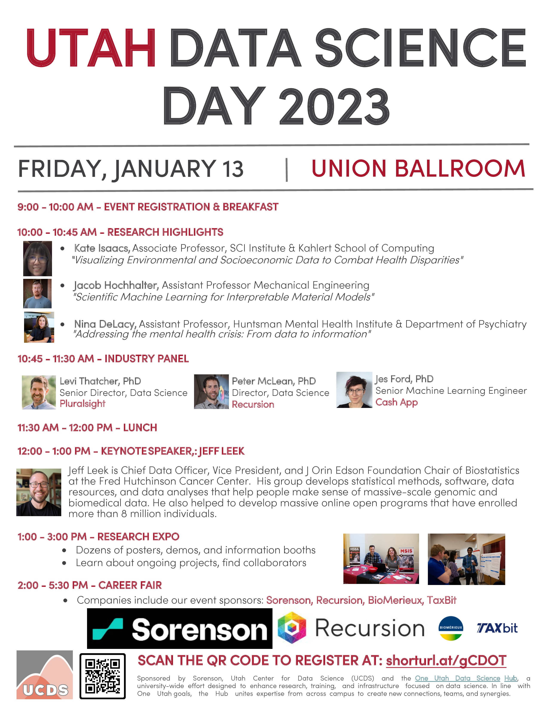
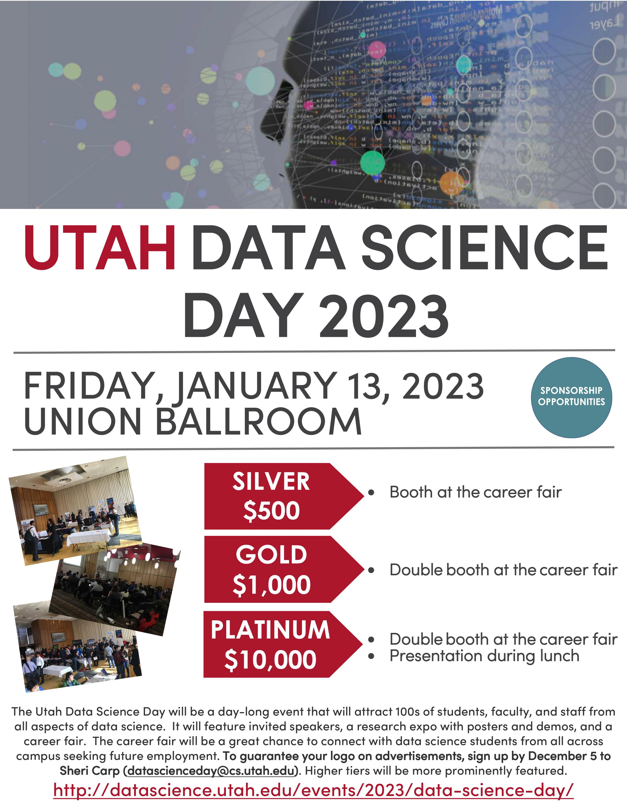
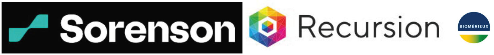

# 2023 Data Science Day

* **Date**: Friday. Jan 13, 2023

* **Location**: [Union Ballroom](https://g.page/unionuofu)

* **Register [here](https://docs.google.com/forms/d/e/1FAIpQLSe95Eymcg2-pd7rs92ysrm2Qw4uVRVS9mDsPiFf027Nc9IDSQ/viewform?usp=sf_link)**

**Organized by**: Utah Center for Data Science and the [One Utah Data Science Hub](https://research.utah.edu/utah-data-science.php)

----

  

  <a href="./assets/data-science-day-schedule.pdf" download>
    

      Schedule
    

      
  </a>
  

  

  <a href="./assets/sponsorship-opportunity.pdf" download>
    

      Industry involvement
    

      
  </a>
  

  

  <a href="./assets/2023 Data Science Day - Research Expo.pdf" download>
    

      Research expo
    

    
  </a>
  

----
## Participation

We welcome all students, staff, and faculty at the University of Utah to participate Utah Data Science Day 2023.  Please register [here](https://docs.google.com/forms/d/e/1FAIpQLSe95Eymcg2-pd7rs92ysrm2Qw4uVRVS9mDsPiFf027Nc9IDSQ/viewform?usp=sf_link).  If you have any questions, contact us at [datasci@utah.edu](datasci@utah.edu).

----
## Schedule

See the [schedule poster](./assets/data-science-day-schedule.pdf) for more information about our speakers.

|  |  |  |
|---|---|---|
| 09:00 AM - 10:00 AM |  | Event Registration & Breakfast |
| 10:00 AM - 10:45 AM |  | Research Highlights  |
|  |  | &nbsp;&nbsp;- **Kate Issacs** &nbsp;&nbsp;&nbsp;&nbsp;Associate Professor - SCI Institute & Kahlert School of Computing &nbsp;&nbsp;&nbsp;&nbsp;*Visualizing Environmental and Socioeconomic Data to Combat Health Disparities* &nbsp;&nbsp;- **Jacob Hochhalter** &nbsp;&nbsp;&nbsp;&nbsp;Assistant Professor - Mechanical Engineering &nbsp;&nbsp;&nbsp;&nbsp;*Scientific Machine Learning for Interpretable Material Models* &nbsp;&nbsp;- **Nina DeLacy** &nbsp;&nbsp;&nbsp;&nbsp;Assistant Professor - Huntsman Mental Health Institute & Department of Psychiatry &nbsp;&nbsp;&nbsp;&nbsp;*Addressing the mental health crisis: From data to information* |
| 10:45 AM - 11:30 AM |  | Industry Panel |
|  |  | &nbsp;&nbsp;- **Levi Thatcher, PhD** &nbsp;&nbsp;&nbsp;&nbsp;Senior Director, Data Science &nbsp;&nbsp;&nbsp;&nbsp;Pluralsight &nbsp;&nbsp;- **Peter McLean, PhD** &nbsp;&nbsp;&nbsp;&nbsp;Director, Data Science &nbsp;&nbsp;&nbsp;&nbsp;Recursion &nbsp;&nbsp;- **Jes Ford, PhD** &nbsp;&nbsp;&nbsp;&nbsp;Senior Machine Learning Engineer &nbsp;&nbsp;&nbsp;&nbsp;Cash App |
| 11:30 AM - 12:00 PM |  | Lunch |
| 12:00 PM - 01:00 PM |  | Keynote by |
|  |  | &nbsp;&nbsp;- **Jeff Leek** &nbsp;&nbsp;&nbsp;&nbsp;45 min talk + 15 Q&A |
| 01:00 PM - 03:00 PM |  |  Research Expo |
|  |  | &nbsp;&nbsp;- Dozens of posters, demos, and information booths |
|  |  | &nbsp;&nbsp;- Learn about ongoing projects, find collaborators |
| 01:00 PM - 02:00 PM |  | Career Fair Set-up (encourage industry participants to view posters etc) |
| 02:00 PM - 05:30 PM |  | Career Fair |
|  |  | &nbsp;&nbsp;- Companies include our event sponsors: Sorenson, Recursion, BioMerieux, TaxBit |

----

### Keynote Talk

**Speaker**: [Jeff Leek](https://jtleek.com)

**Speaker Bio**

Jeff is Chief Data Officer, Vice President, and J Orin Edson Foundation Chair of Biostatistics at the [Fred Hutchinson Cancer Center](https://www.fredhutch.org/). Previously, he was a professor of [Biostatistics](https://www.jhsph.edu/departments/biostatistics/) and [Oncology](https://www.rits.onc.jhmi.edu/dbb/) at the [Johns Hopkins Bloomberg School of Public Health](https://www.jhsph.edu/) and co-director of the [Johns Hopkins Data Science Lab](https://jhudatascience.org/). His group develops statistical methods, software, data resources, and data analyses that help people make sense of massive-scale genomic and biomedical data. As the co-director of the Johns Hopkins Data Science Lab he helped to develop massive online open programs that have enrolled more than 8 million individuals and partnered with community-based non-profits to [use data science education for economic and public health development](https://magazine.jhsph.edu/2019/data-science-careers-baltimores-underserved-community-members). He is a Fellow of the American Statistical Association and a recipient of the [Mortimer Spiegelman Award](https://spiegelmanaward.github.io/) and [Committee of Presidents of Statistical Societies Presidential Award](https://en.wikipedia.org/wiki/COPSS_Presidents%27_Award).

### Career Fair

Attend the career fair to meet with companies including our sponsors: Sorenson, Recursion, BioMerieux, TaxBit

----

### Previously

##### [Data Science Day 2017](../../2017)

##### [Data Science Day 2018](../../2018)

##### [Data Science Day 2019](../../2019)

##### [Datathon 2022](../../datathon/2022)