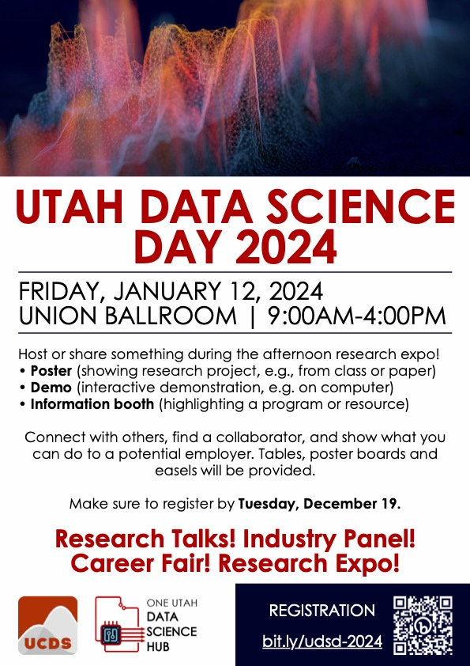

# 2024 Data Science Day

* **Date**: Friday, Jan 12, 2024
* **Location**: [Union Ballroom](https://g.page/unionuofu)
* **Register [here](https://bit.ly/udsd-2024)**

**Organized by**: Utah Center for Data Science and the [One Utah Data Science Hub](https://research.utah.edu/utah-data-science.php)

----

  <!-- 

  <a href="./assets/data-science-day-schedule.pdf" download>
    

      Schedule
    

      
  </a>
  
 -->

  

  <a href="./assets/DSD2024-General.pdf" download>
    

      General Flyer
    

    
  </a>
  

----

## Participation

We welcome all students, staff, and faculty at the University of Utah to participate Utah Data Science Day 2024.  Please register [here](https://bit.ly/udsd-2024).  If you have any questions, contact us at [datasci@utah.edu](datasci@utah.edu).

----

### Previous Events

* [Data Science Day 2023](../../2023/data-science-day)
* [Datathon 2022](../../datathon/2022)
* [Data Science Day 2019](../../2019)
* [Data Science Day 2018](../../2018)
* [Data Science Day 2017](../../2017)
